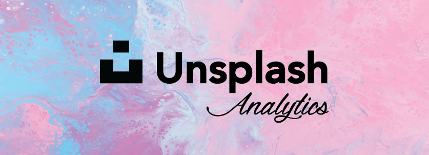
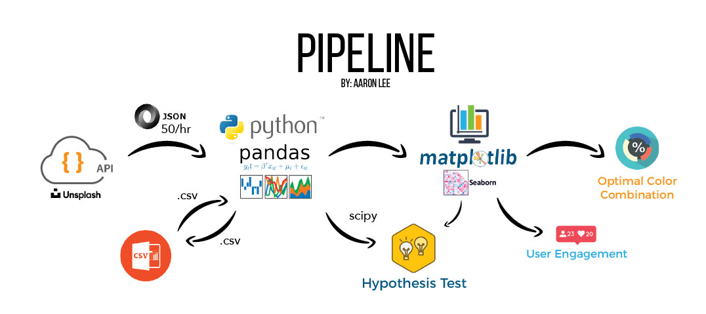
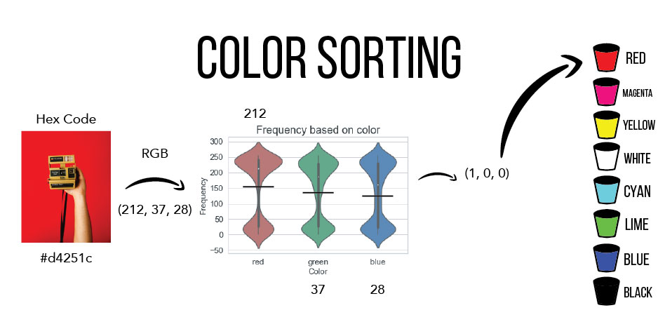
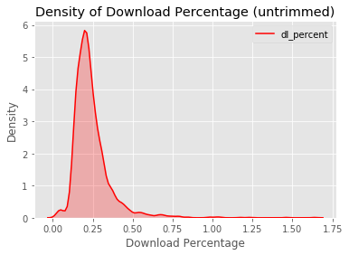
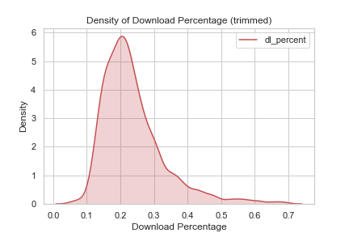
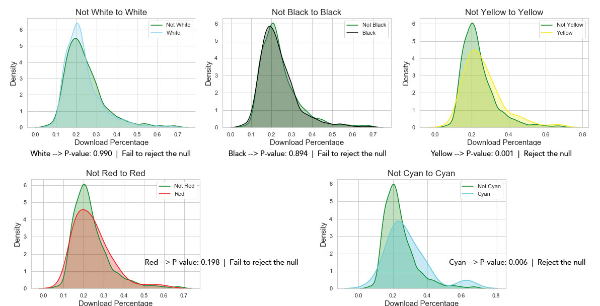

# Understanding Color in Stock Photography
**Identifying which colors in an image produces more user engagement**
 Aaron Lee
 
[Linkedin](http://www.linkedin.com/in/aaronhjlee) | [Github](https://github.com/aaronhjlee) | [Unsplash](https://unsplash.com/@aaronhjlee) \
[Short Presentation](https://docs.google.com/presentation/d/1DdgE7bC93VKDTPsZa_T6cJoODqEK9ZSs_zzk3lMAELs/edit?usp=sharing) | 
[Long Presentation](https://docs.google.com/presentation/d/1C_A-BuNdKYGHDKSGqTRlnyGbjoOI2_pG32Rbb9TznKE/edit?usp=sharing)

## Table of Contents

* [Motivation](#motivation)
  * [Personal](#personal)
  * [Question](#question)
* [Data Exploration](#data-exploration)
  * [Pipeline](#pipeline-source)
  * [Engagement](#engagement)
   * [Why](#why)
  * [Color Sorting](#color-sorting)
* [Hypothesis Testing](#hypothesis-testing)
  * [Set-Up](#set-up)
  * [Mann Whitney U Test](#mann-whitney-u-test)
* [Conclusion](#conclusion)
* [Future Analysis](#future-analysis)
* [Tools Used](#tools-used)
* [Contact](#contact-information)

## Motivation

### Personal

I have been interested in photography since 2012 and, like every other photographer out there, have always wondered what makes a good picture? I got very lucky that the [best picture](https://unsplash.com/photos/WrPmNpKQUUY) I have taken and posted just happens to be my most popular photo amongst the [Unsplash](https://unsplash.com) community. But what exactly are the elements of a picture that make it universally well-received despite it being an very subjective because, well, it's a form of art. 

### Question

With many variables such as [composition](https://en.wikipedia.org/wiki/Composition_(visual_arts)), [subject](https://www.creativelive.com/photography-guides/photography-subjects), [post-processing](https://improvephotography.com/31639/post-processing-photography/), among many other variables, you can see it becomes increasingly difficult to create the 'perfect' photo. But **what if** we could narrow down the variables to produce a picture in which it illicits a response from a viewer in the form of a download, like, or share?
In this case, we will be taking a look at color, specifically the average color of all the pixels in a photo, in order to determine the characteristics of a photo that will increase engagement from viewers.

## Data Exploration

### Pipeline (Source)

[Unsplash API](https://unsplash.com/developers) - contains photo metadata \
Dataset - 2,400+ photos

### Engagement

#### Why

Why is it important to track engagment?
The information allows contributors to tailor their content in a way that promotes their photos or brands more efficiently. One of the goals of this exploration is to determine the ideal colors in a photo affect the number of user engagement with said photo. There are 3 metrics to measure engagement the photo [metadata](https://en.wikipedia.org/wiki/Metadata) provides: likes, downloads, and views. Since these pictures are all free to use in (almost) any form or medium, this website may provide insight for photos without the [paywall](https://en.wikipedia.org/wiki/Paywall) and terms of use compared to traditional stock photography sites. 

How do we get a statistic on engagment?
This portion is simple. We use the formula of (total downloads / total views) x 100 = download percentage (aka level of user engagement).

### Color Sorting

In order to see if color makes a difference in terms of engagement, we have to first need to sort each picture into a color category. To keep things simple, we will have 8 possible categories consisting of: red, magenta, yellow, white, cyan, lime, blue, and black.
1. Convert the [hex code](https://en.wikipedia.org/wiki/Web_colors) to [RGB](https://techterms.com/definition/rgb) values
2. Find the median value of the frequencies of which red, green, and blue occur. This will be the threshhold at which a photo's RGB value would be compared to. If the value is greater than the threshhold, we will assign a '1' and conversely a '0'. 
3. Based on the 3 element [tuple](https://en.wikipedia.org/wiki/Tuple) that was returned, we are able to categorize photos by color.

**Median red: 152 | Median green: 141 | Median blue: 133** \
Below is a visual example of how this method is implimented. 

## Hypothesis Testing

### Set-Up

Before we can run any sort of tests, we have to take a look at how the data is distributed. Upon initial examination, we can see that density plot of the download percentage is skewed right with a long tail (below).

Next we take the outliers (top and bottom 1%) and re-plot the density of the download percentage. We do not believe these are representative of most of the pictures in our sample dataset due to their extremely high or low view count, resulting in a skewed download percentage. 

Once again, it proves to be skewed right. One final calculation, returning a p-value of 0.3301, allows us to definitively conslude that our distribution is **not** normal. 

### Mann Whitney U Test

Since we will be comparing two independent samples from our sample population with similar distributions, we will be conducting a [Mann-Whitney U Test](https://en.wikipedia.org/wiki/Mann%E2%80%93Whitney_U_test). 

 * Null Hypothesis: User engagement of not-color pictures > User engagement of color pictures 
 * Alternative Hypothesis: User engagement of not-color pictures ≤ User engagement of color pictures 
 * Alpha: 0.01* 
 
 *Normally we assume an alpha of 0.05, but since we're conducting 5 tests, we need to adjust by dividing by the number of tests (0.05 / 5) = 0.01

## Conclusion

Looking at the weighted color average of an image, categorizing them, and comparing colors with the U test, there is a possibility that photos labeled **yellow** and **cyan** encourage more user engagement in the form of downloads at a higher rate than it's counterparts images. 

## Future Analysis

* Scale
  * More photos
  * Improving accuracy of color categorization with the use of ai
  * Multiple stock photography sites
* Variables to Consider
  * Camera model ([color science](https://nofilmschool.com/Canon-Color-Science))
  * Specifiying time of upload
  * Limiting photo composition
  * Further grouping portraits, landscape, lifestyle, and product shots

## Tools Used

* [Python](https://www.python.org/)
* [Pandas](https://pandas.pydata.org/)
* [Numpy](http://www.numpy.org/)
* [SciPy](https://www.scipy.org/)
* [Matplotlib](https://matplotlib.org/)
* [Seaborn](https://seaborn.pydata.org/)
* [Json](https://www.json.org/)
* [Unsplash API](https://unsplash.com/developers)

## Contact Information
Aaron Lee is a Data Scientist who is with a background in education and portrait/landscape photography. His interests other than data science include music, photography, backpacking, basketball, and running. 

* Linkedin: [in/aaronhjlee](https://www.linkedin.com/in/aaronhjlee/)
* Github: [/aaronhjlee](https://github.com/Aaronhjlee)
* Unsplash: [@aaronhjlee](https://unsplash.com/@aaronhjlee)
